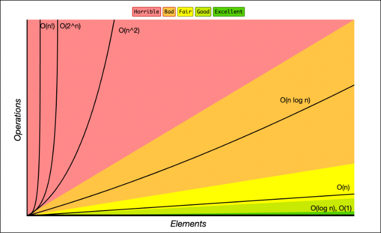

# RSP2023
<!-- TOC start (generated with https://github.com/derlin/bitdowntoc) -->
- [1.0 Study books note](#)
- [2.0 Algorithm Analysis Concepts](#)
    * [Big O Notation](#)
        * [Time Complexity](#)
        * [Space Complexity](#)

<!-- TOC end -->
<!-- TOC --><a name="algorithms-and-data-structures-cheat-sheet"></a>
# 1.0 Study books note
Materials to learn <b>The Algorithm Design Manual </b>.
- Text book: https://github.com/wendy-ha18/RSP2023/blob/main/the-algorithm-design-manual-3th-edition.pdf. 
- Youtube channel of Professor Steven Kiena: https://www3.cs.stonybrook.edu/~skiena/373/videos/.
- Slides: https://www3.cs.stonybrook.edu/~skiena/373/current-lectures/. 
# 2.0 Algorithm Analysis Concepts
## 2.1 Big O Notation
Big O notation is a way to describe the efficiency or complexity of an algorithm. It provides a rough estimate of how long an algorithm will take to run, based on the size of the input data.

In computer science, the "O" in Big O notation is used to describe the upper bound of an algorithm's running time. For example, if an algorithm has a running time of O(n), it means that the algorithm's running time grows most linearly with the size of the input data. This means that if the input size doubles, the running time of the algorithm will approximately double as well.

### 2.1.1 Time Complexity
Several common complexities are described using Big O notation, including:

-   `O(1)`: Constant time. The running time of the algorithm is independent of the size of the input data.

E.g:
```ts
function addUpComplex(n: number): void {
    return (n * (n + 1)) / 2;
}
```

-   `O(log n)`: Logarithmic time. The running time increases logarithmically with the size of the input data.

E.g:
```ts
function addUpToSimple(n: number): void {
    let total = 0;
    for (let i = 0; i < n; i++) {
        total += i;
    }

    return total;
}
```

-   `O(n)`: Linear time. The running time increases linearly with the size of the input data.

-   `O(n log n)`: Log-linear time. The running time increases logarithmically with the size of the input data, but with a smaller coefficient than `O(log n)`.

-   `O(n^2)`: Quadratic time. The running time increases as the square of the size of the input data.

-   `O(n^3)`: Cubic time. The running time increases as the cube of the size of the input data.

-   `O(2^n)`: Exponential time. The running time increases exponentially with the size of the input data.

Big O notation is useful for comparing the efficiency of different algorithms, as well as for predicting the performance of an algorithm on larger inputs. However, it is important to note that Big O notation only provides an upper bound on an algorithm's running time, and actual running times may be faster in practice.

The following chart is a comparison of the common complexities, from fastest to slowest:



### 2.1.2 Time Complexity
