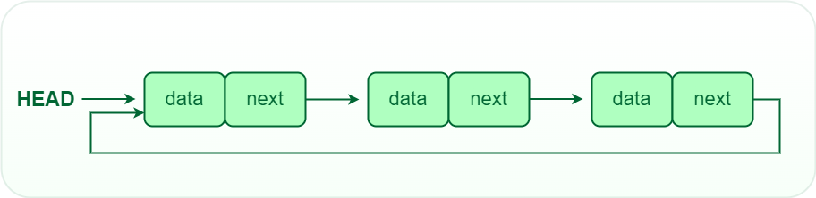
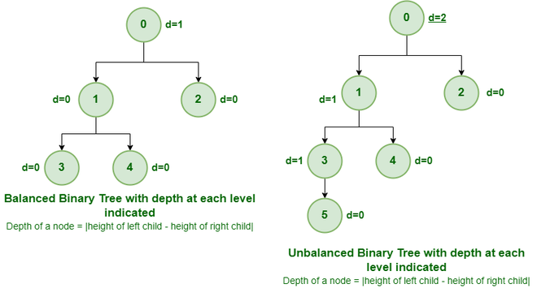
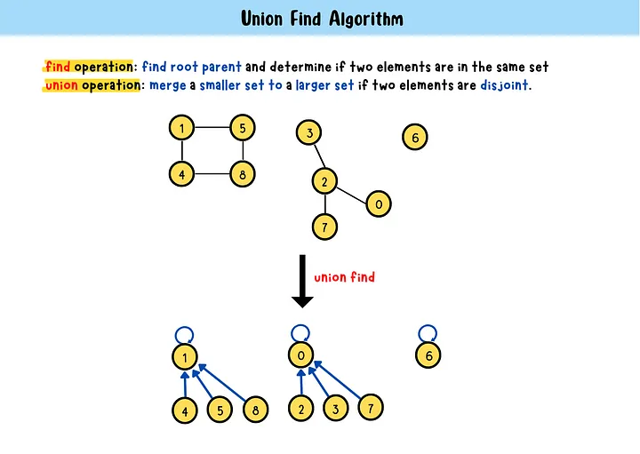

# Algorithmic complexity / Big-O / Asymptotic analysis
Big O notation is a way to describe the efficiency or complexity of an algorithm. It provides a rough estimate of how long an algorithm will take to run, based on the size of the input data.

## Time Complexity

- Big-Oh (O) Notation describes the worst-case run time (asymptotic upper bound of an algorithm).
- Big-Omega (Ω) Notation reveals the best-case run time (asymptotic lower bound of an algorithm).
- Big-Theta (ϴ) Notation encapsulates the extremes and provides a tight and consistent range (average). But, is confined to matching time complexities.


The following chart is a comparison of the common complexities, from fastest to slowest:

- O(1) > logn > n > nlogn > $n^2$ > $n^3$ > $2^n$ > n! > $2^{2n}$


## Space Complexity
In simple words, it is the amount of memory required to run a program, proportional to the input size that's fed in. For computing the space complexity, we ought to consider two factors:

- Input space: Space used by input.
- Auxiliary space: The additional space used by the algorithm, e.g., to hold temporary variables or the space used by the activation stack.

# Array
- Defination: 

A collection of items of the same data type stored at contiguous memory locations or says the elements are stored one after another in memory. An array uses an index system starting at 0 and going to (n-1), where n is its size.
- Static array vs Dynamic array:
    * Static array: 
        - fixed size, once the memory is allocated to them, it cannot be increased or decrease
    * Dynamic array: 
        - memory is allocated at run time but not having a fixed size. We can change the size of the array later by using delete[ ]which is used to to deallocate the memory and allocating a new block with a different size if desired.

```py
        //  Static Array
        int[] staticArray = new int[5];
        int[] numbers = { 1, 2, 3, 4, 5 };
        // Dynamic Array
        // Create an ArrayList of integers.
        ArrayList<Integer> dynamicArray = new ArrayList<>();
 
        // Add elements to the dynamic array.
        dynamicArray.add(1);
        dynamicArray.add(2);
        dynamicArray.add(3);
 
        // Remove an element from the dynamic array.
        dynamicArray.remove(1);
```

- Advantages:
    * Allow random access to elements. This makes accessing elements by position faster.
    * Store multiple data of similar types with the same name.
    * Data structures are used to implement the other data structures like linked lists, stacks, queues, trees, graphs, etc.
- Disvantages:
    * Store data in contiguous memory locations, which makes deletion and insertion very difficult to implement. This problem is overcome by implementing linked lists, which allow elements to be accessed sequentially.
- Big O:
    * Search/get: O(1)
    * Access: O(n)
    * Insert/delete in the middle: O(n), at the end (O(1))

# Linked List
- Defination:  a linear data structure, in which the elements are not stored at contiguous memory locations. A linked list consists of nodes where each node contains a data field and a reference(link) to the next node in the list.

-  Singly-linked list:
    * Each element is connected only to its next element using a pointer.

    * Implementation: [Code Snippet](Implementation/SinglyLinkedList.py)
    * Big O:
        - Time: N is total number of nodes.
            - get: O(N)
            - addAtHead: O(1)
            - addAtTail: O(N), can optimize to (1) if we store tail pointer
            - addAtIndex: O(N)
            - deleteAtIndex: O(N)
        - Space: O(1) each operation

- Doubly linked list:
    * Each node contains a pointer to the previous node as well as the next node of the linked list.
    

    * Implementation: [Code Snippet](Implementation/DoublyLinkedList.py)
    * Big O:
        - Time: N is total number of nodes.
            - get: O(N)
            - addAtHead: O(1)
            - addAtTail: O(1)
            - addAtIndex: O(N)
            - deleteAtIndex: O(N)
        - Space: O(1) each operation
- Circular linked lists: 
    * The last node of the list contains a pointer to the first node of the list. We traverse the circular singly linked list until we reach the same node where we started. The circular singly linked list has no beginning or end. 
    * Big O:
        * Time: n is total number of nodes. k is the given index where you want to insert/delete the node.
            - get: O(Min(k, n - k))
            - addAtHead: O(1)
            - addAtIndex: O(Min(k, n - k))
            - addAtTail: O(1)
            - deleteAtIndex: O(Min(k, n - k))
            
            The complexity is O(Min(k, n - k)) because you want to choose the most efficient way to traverse the circular list to find the insertion point. It's either starting from the head and moving forward (k) or starting from the tail and moving backward (n - k). The idea is to minimize the traversal distance to the insertion point.
        * Space: all operation O(1)



# Tree
- Defination: A Tree is a non-linear data structure and a hierarchy consisting of a collection of nodes such that each node of the tree stores a value and a list of references to other nodes (the “children”).


- Types of tree: 


- Binary Tree: 
    - A binary Tree is defined as a Tree that each node of this tree has only 2 children.
- Binary Search Tree (BTS):
 is a node-based binary tree data structure that has the following properties: the left subtree of a node contains only nodes with keys lesser than the node’s key. The right subtree of a node contains only nodes with keys greater than the node’s key.
    - Implementation: [Code Snippet](Implementation/BinarySearchTree.py)
    - Big O:
        - Time: 
            - traversal(): O(number of node)
            - search(var): O(the height of the BST)
            - insert(var): O(search) + O(1)insert = O(the height of the BST)
            - delete(var): O(search) + O(1)delete = O(the height of the BST)
        - Space: O(1) if no recursion stack space is considered. Otherwise, O(h) where h is the height of the tree.
            - In the worst case, h can be the same as N (when the tree is a skewed tree).
            - In the best case, h can be the same as logN (when the tree is a complete tree).

- Binary Tree Traversals:
    - Inorder traversal: left - root - right
        - Application: to get the nodes in non-decreasing order.
    - Preorder traversal: root - left - right
        - Application: creating a copy of a tree or get the prefix expression from an expression tree.
    - Postorder traversal: left - right - root.
        - Application: used for tree deletion or get the postfix expression from an expression tree.

```
E.g: We have this binary tree:
    #           1
    #        /      \
    #       2        3
    #      /  \       \
    #    4     5       6
Inorder traversal: 4 2 5 1 3 6 
Preorder traversal: 1 2 4 5 3 6
Postorder traversal: 4 5 2 6 3 1
```

- Balanced Binary Tree:
    - Defination: 
    
        - A binary tree is balanced if the height of the tree is O(Log n), or in another way, the height of the left and right tree for any node does not differ by more than 1. 
        - The left subtree of that node is also balanced.
        - The right subtree of that node is also balanced.
    - Application of Balanced Binary Tree:
        - AVL Trees (inventors Adelson, Velskii, and Landis):
            - AVL tree maintains O(Log n) height by making sure that the difference between the heights of the left and right subtrees cannot be more than 1. This difference is called the "balance factor" (= left subtree height – right subtree height).
            - Process:
                1. Perform the normal BST insertion. 
                2. The current node must be one of the ancestors of the newly inserted node. Update the height of the current node. 
                3. Get the balance factor (left subtree height – right subtree height) of the current node. 
                    - If the balance factor is greater than 1, then the current node is unbalanced and we are either in the Left Left case or left Right case. To check whether it is left left case or not, compare the newly inserted key with the key in the left subtree root. 
                    - If the balance factor is less than -1, then the current node is unbalanced and we are either in the Right Right case or Right-Left case. To check whether it is the Right Right case or not, compare the newly inserted key with the key in the right subtree root.    
            - Re-balance: 
                - z be the first unbalanced node, y be the child of z that comes on the path from w to z and x be the grandchild of z that comes on the path from w to z. 
```
1. Left Left Case:

T1, T2, T3 and T4 are subtrees.
         z                                      y 
        / \                                   /   \
       y   T4      Right Rotate (z)          x      z
      / \          - - - - - - - - ->      /  \    /  \ 
     x   T3                               T1  T2  T3  T4
    / \
  T1   T2
                
2. Left Right Case:

     z                               z                           x
    / \                            /   \                        /  \ 
   y   T4  Left Rotate (y)        x    T4  Right Rotate(z)    y      z
  / \      - - - - - - - - ->    /  \      - - - - - - - ->  / \    / \
T1   x                          y    T3                    T1  T2 T3  T4
    / \                        / \
  T2   T3                    T1   T2

3. Right Right Case:

  z                                y
 /  \                            /   \ 
T1   y     Left Rotate(z)       z      x
    /  \   - - - - - - - ->    / \    / \
   T2   x                     T1  T2 T3  T4
       / \
     T3  T4

4. Right Left Case:

   z                            z                            x
  / \                          / \                          /  \ 
T1   y   Right Rotate (y)    T1   x      Left Rotate(z)   z      y
    / \  - - - - - - - - ->     /  \   - - - - - - - ->  / \    / \
   x   T4                      T2   y                  T1  T2  T3  T4
  / \                              /  \
T2   T3                           T3   T4         
```


# Graph
- Defination: 

A Graph is a non-linear data structure consisting of vertices (V) and edges (E). The vertices are sometimes also referred to as nodes and the edges are lines or arcs that connect any two nodes in the graph.

Graphs may contain cycles, so we may come to the same node again (the different between graph and tree).

- Representations of Graph:
    - Adjacency Matrix: 
        * Representing a graph as a matrix of boolean (0’s and 1’s).
        - Implementation: [Code Snippet](Implementation/GrapthWithAdjacencyMatrix.py)
        - Big O: 
            - Time: Insertion/ Deletion of an edge: O(1), O($n^2$) to display the adjacency matrix. 
            - Space: O($n^2$)
    - Adjacency List: 
        - An array of Lists is used to store edges between two vertices. The size of array is equal to the number of vertices (i.e, n). Each index in this array represents a specific vertex in the graph.
        - Implementation: [Code Snippet](Implementation/GraphWithAdjacencyList.py)
        - Big O: 
            - Time: O(|E| / |V|) , which may result in O($n^3$) complexity for dense graphs to remove all edges.
            - Space: O(number of vertices).


- Graph Traversal
    - Breadth-First Search (using Queue): 
        - For each node, first, the node is visited and then it’s child nodes are put in a FIFO queue. Then again the first node is popped out and then it’s child nodes are put in a FIFO queue and repeat until queue becomes empty.
        - Implementation using Adjacency List: [Code Snippet](Implementation/BFS.py).
        - Big O:
            - Time: O(V+E), where V is the number of nodes and E is the number of edges.
            - Space: O(V)
    - Depth First Search (using Stack):
        - Process:
        
        (1) putting any one of the graph's vertices on top of a stack 
        
        (2) pop the top item of the stack and add it to the visited list 
        
        (3) create a list of that vertex's adjacent nodes. Add the ones which aren't in the visited list to the top of the stack 
        
        (4) keep repeating steps 2 and 3 until the stack is empty.
        - Implementation using Adjacency List: [Code Snippet](Implementation/DFS.py).
        - Big O:
            - Time: O(V+E), where V is the number of nodes and E is the number of edges.
            - Space: O(V).

- Shortest Paths in Graph
    - Dijkstra’s shortest path algorithm
        - Defination: 
            - Dijkstra’s algorithm works on directed graphs, where nodes are connected with weighted non-negative edges. The algorithm finds the distance from a single source node to all other nodes in the graph.
        - Application: It is essential for solving problems such as network routing and mapping.
        - Process: 
            - (1) Initialize the source node to take value 0 and all other nodes to ∞. Start with node 0 as the “current node.” 
            - (2) Find all neighboring nodes and update their values to either the minimum of their value or the value of the current node plus its distance. Mark the node as finished.
            - (3) Assign the minimum-valued unfinished node as the current node.
            - (4) Repeat steps 2 and 3 until all nodes (or a specific node of interest) are finished.
        - Big O:
            - Time: O($V^2$) if the input graph is represented using adjacency matrix and O(E * log V) with adjacency list (because the help of a binary heap).

- Minimum Spanning Tree (MST)
    - Greedy Algorithm: 
        - An approach for solving a problem by selecting the best option available at the moment. It picks the path that seems optimal at the moment without regard for the overall optimization of the solution that would be formed.
        - Greedy Approach is not always correct.
    - Spanning Tree:
        - A subset of the edges of the graph that forms a tree (acyclic) where every node of the graph is a part of the tree.
    - Minimum Spanning Tree (MST):
        - A spanning tree that has the minimum weight among all the possible spanning trees.
        - In MST: number of edges = (number of vertices - 1).
    - Kruskal’s Minimum Spanning Tree (MST) Algorithm:
        - Purpose: finding the minimum spanning tree from a connected, undirected graph.
        - Process:
            1. Sort all the edges in non-decreasing order of their weight. 
            2. Pick the smallest edge. Check if it forms a cycle with the spanning tree formed so far (uses the <strong>Union-Find algorithm</strong> to detect cycles). If the cycle is not formed, include this edge. Else, discard it. 
            3. Repeat step#2 until (number of edges included in the MST) equals to (V – 1), so the algorithm stops here.
        - Big O:
            - Time: O(E * logE) or O(E * logV) 
                - Sorting of edges takes O(E * logE) time. 
                - After sorting, we iterate through all edges and apply the find-union algorithm. The find and union operations can take at most O(logV) time.
            - Space: O(V + E).
- Union-Find/Disjoint Set Algorithm (Detect Cycle in a Graph):
    - What is a Disjoint set data structure: Two sets are called disjoint sets if they don’t have any element in common, the intersection of sets is a null set.
    - Operations on Disjoint Set Data Structures:
        - Find: implemented by recursively traversing the parent array until we hit a node that is the parent of itself.
        - Union: by Rank/Size and Path Compression.
    - Big O:
        - Time: O(n) for creating n single item sets
        - Space: O(n).




